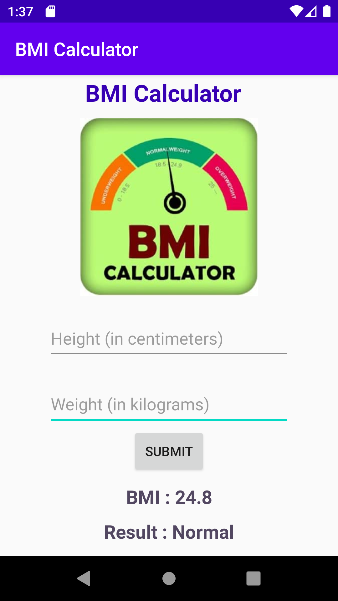

# <b>
BMI-Calculator
</b>
An android app to calculate bmi.  The application will also tell whether a person is thin, normal or obese by using the height and weight given by the user.

The application get the height (in centimeters) and weight (int kilograms) from the user.  when the user enter the value and press submit button, It will calculate the BMI and display the results. 

